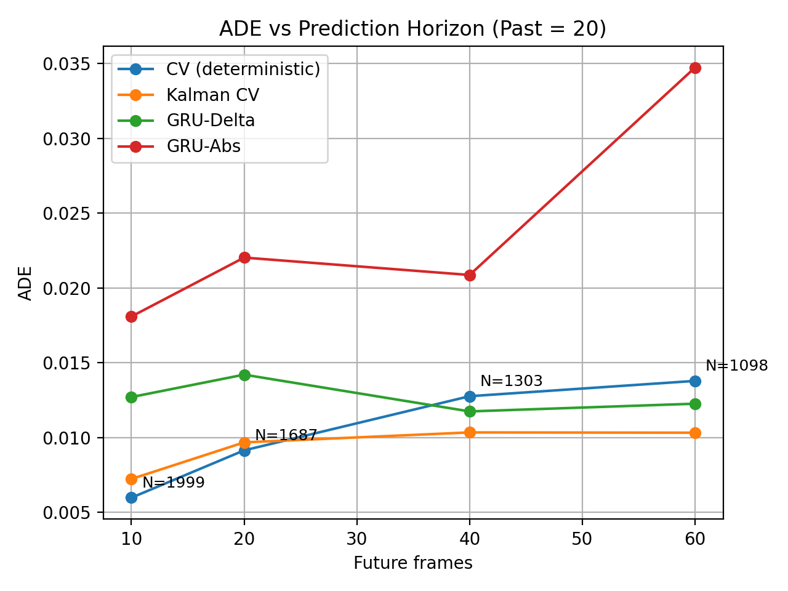
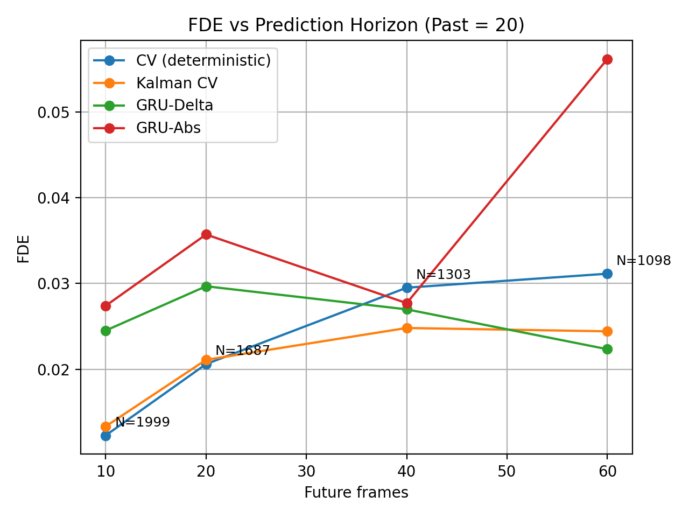

## Figures and Analysis

This section summarizes the behavior of the detection–tracking pipeline under different detection confidence thresholds using **ByteTrack** on CARLA simulation footage. Since no ground-truth multi-object tracking annotations are available, the figures focus on **self-consistency and temporal stability metrics** rather than absolute accuracy.

---

### Figure 1: ADE vs Prediction Horizon (Past = 20)

This plot shows how average error across the full rollout changes as the horizon increases.

Key behavior:

- CV (deterministic) is strong at short horizons (Future=10) but degrades steadily as horizon grows. This is expected: constant velocity accumulates drift when objects accelerate, brake, or turn.
- Kalman CV is consistently the best or tied-best across horizons, especially beyond Future=20. The filtering step stabilizes velocity estimates and reduces jitter from tracking noise.
- GRU-Delta is competitive, particularly at longer horizons (Future=40–60), where it tracks close to the Kalman baseline. Predicting deltas tends to be more stable than predicting absolute positions because the model learns motion increments rather than raw coordinates.
- GRU-Abs is consistently the worst and shows a sharp degradation at Future=60, suggesting instability in long-horizon rollouts (small absolute-coordinate errors compound into large trajectory divergence).

Overall, ADE suggests that Kalman CV is a very strong baseline, and GRU-Delta is the only learned model that behaves reliably under longer rollouts.

### Figure 2: FDE vs Prediction Horizon (Past = 20)

FDE measures endpoint accuracy, which is usually harsher than ADE because it reflects total accumulated drift by the final step.

Key behavior:

- CV (deterministic) shows increasing endpoint drift with horizon, becoming the second-worst at longer horizons.
- Kalman CV again performs best overall, showing the most stable growth with horizon.
- GRU-Delta remains stable and is particularly strong at longer horizons (notably Future=60). Part of this can be genuine robustness, and part can be the N shrinkage effect (the longest-lived tracks used for Future=60 may be smoother).
- GRU-Abs spikes dramatically at Future=60, which is exactly what you see when a model’s rollout becomes unstable: the endpoint blows up even if intermediate steps looked reasonable at shorter horizons.

The key takeaway from FDE is that absolute-coordinate prediction is fragile here, while delta-parameterization + filtering-style baselines remain stable.
